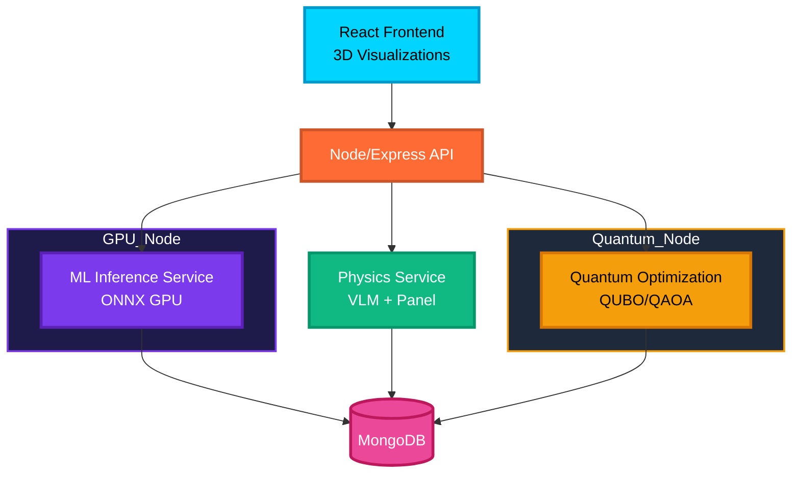

# 🏎️⚛️ Quantum-Aero F1 Prototype - Evolution Platform


[](Project_Development_Markdowns/IMPLEMENTATION_PROGRESS.md)
[](Project_Development_Markdowns/PROJECT_STATUS_WITH_EVOLUTION.md)
[](.)
[](.)

A revolutionary **AI + Quantum Computing + Real-Time CFD** platform for Formula 1 aerodynamic optimization. Combines Vision Transformers, Graph Neural Networks, Variational Quantum Eigensolvers, and advanced 3D visualizations into a production-ready system.

## 🚀 Evolution Roadmap (2026-2027)

**Current Status**: Phase 1 - 70% Complete | Overall - 32% Complete

### Phase 1: Advanced AI Surrogates (Q2 2026) - 70% ✅
- ✅ **AeroTransformer** - Vision Transformer + U-Net (<50ms CFD inference)
- ✅ **GNN-RANS** - Graph neural networks (1000x faster than OpenFOAM)
- ✅ **VQE Quantum** - Variational quantum eigensolver (50-100 qubits)
- 🟡 **AeroGAN** - Generative design (optional)

### Phase 2: Quantum Scale-Up (Q3 2026) - 10% 🟡
- 🟡 **D-Wave Annealing** - 5000+ variable quantum optimization
- 🟠 **Hybrid Solver** - Quantum-classical integration

### Phase 3: Generative Design (Q4 2026) - 0% 🔴
- 🔴 **Diffusion Models** - Conditional 3D geometry generation
- 🔴 **RL Active Control** - PPO for DRS/flap optimization

### Phase 4: Production (Q1 2027) - 0% 🔴
- 🔴 **Digital Twin** - NVIDIA Omniverse (<100ms latency)
- 🔴 **Telemetry Loop** - Real-time track data integration

## ⚡ Quick Start

```bash
# 1. Clone repository
git clone https://github.com/rjamoriz/Quantum-Aero-F1-Prototype.git
cd "F1 Project NexGen"

# 2. Run automated setup
./setup_evolution.sh

# 3. Start services
python api_gateway.py  # API Gateway (port 8000)
python -m ml_service.models.aero_transformer.api  # Port 8003
python -m ml_service.models.gnn_rans.api          # Port 8004
python -m quantum_service.vqe.api                 # Port 8005

# 4. Start frontend
cd frontend && npm start  # Port 3000

# 5. Run tests
pytest tests/test_integration.py -v
```

**Access**:
- Frontend: http://localhost:3000
- API Docs: http://localhost:8000/docs
- Health Check: http://localhost:8000/health

## Phase 1 (Current Critical Path)

Use the microservice stack with orchestration enabled:

```bash
docker compose up --build backend physics-engine ml-surrogate quantum-optimizer mongodb redis nats
```

New coupled endpoints available via backend:

- `POST /api/simulation/run` : orchestrates VLM + ML + optional quantum node optimization + CFD proxy coupling.
- `GET /api/simulation` : lists recent simulation runs with progress and workflow state.
- `GET /api/simulation/:id` : retrieves the stored run record.
- `GET /api/simulation/cfd/jobs/:jobId` : checks CFD adapter job status directly.
- `POST /api/quantum/optimize-vlm-nodes` : QUBO optimization on VLM node drag/lift metrics.
- `POST /api/claude/chat` : local orchestrator response using ML/physics/quantum snapshots.
- `POST /api/claude/message` : single-response Claude hook contract (`{ content, metadata }`).
- `POST /api/claude/stream` : SSE stream contract for tokenized chat updates.
- `POST /api/agents/chat` : compatibility alias to Claude chat route.
- `POST /api/auth/register` : local account registration for frontend auth contract.
- `POST /api/auth/login` : JWT login for local dashboard auth.
- `GET /api/auth/me` : token introspection for current user context.
- `GET /api/ml/stats` : ML surrogate runtime stats (mode, inference timing, cache hit rate).
- `POST /api/ml/cache/clear` : clears ML surrogate cache for fresh coupled reruns.
- `POST /api/multi-fidelity/evaluate` : executes low→medium→high fidelity escalation based on confidence thresholds.
- `GET /api/system/health` : aggregated operational health (service readiness, latency, simulation load, ML runtime cache stats).
- `GET /api/aeroelastic/modes` : structural mode dataset for the mode-shape viewer.
- `GET /api/aeroelastic/flutter-analysis` : V-g diagram + flutter margin dataset for aeroelastic dashboard.
- `POST /api/transient/run-scenario` : transient aero-structural scenario runner output (time/downforce/drag/displacement/modal energy).
- `POST /api/transient/generate-scenarios` : synthetic transient scenario materialization.
- `POST /api/data/generate-airfoils` : NACA-inspired airfoil profile generation metadata.
- `POST /api/data/generate-geometry` : geometry-variation generation metadata.
- `POST /api/data/store-dataset` : dataset storage contract used by synthetic data generator.
- Legacy UI compatibility aliases:
  - `POST /api/quantum/optimize-wing`
  - `POST /api/quantum/optimize-complete-car`
  - `POST /api/quantum/optimize-stiffener-layout`
  - `POST /api/quantum/optimize-cooling-topology`
  - `POST /api/quantum/optimize-transient`

Notebook demo:

- `notebooks/vlm_quantum_cfd_coupling_demo.ipynb` for synthetic NACA-inspired node data, QUBO, and coupled CFD proxy visualization.
- `notebooks/phase1_vlm_quantum_cfd_workbook.ipynb` for an expanded Phase 1 workflow with a NASA/NACA dataset adapter (real files when found, synthetic fallback), QUBO solving, and iterative CFD-proxy coupling plots.

Frontend visualization update:

- `frontend/src/components/VLMVisualization.jsx` now supports a direct `Run Coupled Quantum + CFD` workflow with:
  - VLM node highlighting from quantum-selected control points.
  - Node drag-vs-lift scatter visualization with selected-node overlay.
  - Spanwise drag/lift distributions with selected-ratio trend.
  - Coupled iteration plots (`CL`, `CD`, `L/D`, residuals, selected nodes).
  - CFD adapter run diagnostics (engine/solver per coupling stage).
- Operations dashboards now use live backend endpoints:
  - `SystemHealthDashboard` -> `/api/system/health`
  - `JobOrchestrationDashboard` -> `/api/simulation`, `/api/simulation/:id`, `/api/simulation/run`
  - `WorkflowVisualizer` -> live orchestration state from `/api/simulation*`
  - `AgentActivityMonitor` -> `/api/claude/agents`, `/api/simulation`, `/api/system/health`

Simulation response additions:

- `visualizations.node_analytics` is now attached to `/api/simulation/run` and `/api/simulation/:id` payloads:
  - `top_lift_nodes`, `top_drag_nodes`
  - `spanwise_distribution`
  - `lift_drag_correlation`

`/api/simulation/run` supports:

- `coupling_iterations` (1-20): number of quantum↔CFD proxy coupling passes.
- `async_mode` (`true|false`): when `true`, returns `202` and a `poll_url` for status/result retrieval.
- `use_cfd_adapter` (`true|false`): enables/disables CFD adapter execution (falls back to proxy when disabled).

CFD adapter configuration (backend env vars):

- `CFD_ENGINE=mock|http` (default: `mock`)
- `CFD_SERVICE_URL=http://...` (required for `CFD_ENGINE=http`)
- `CFD_TIMEOUT_MS=45000` (optional timeout override)

Physics service compatibility endpoints:

- `POST /api/v1/flow-field` : flow vector/streamline/vortex dataset for 3D flow viewer.
- `POST /api/v1/panel-solve` : panel mesh/source-strength dataset for panel visualization.
- `POST /api/vlm/batch-simulate` : batched synthetic VLM dataset contract for data-generation pipelines.

Production hardening updates:

- Frontend API targets are now environment-driven (no hard dependency on localhost in UI code):
  - `REACT_APP_BACKEND_URL` (default: `http://localhost:3001`)
  - `REACT_APP_PHYSICS_URL` (default: `http://localhost:8001`)
  - `REACT_APP_ML_URL` (default: `http://localhost:8000`)
  - `REACT_APP_GNN_URL` (default: `http://localhost:8004`)
  - `REACT_APP_VQE_URL` (default: `http://localhost:8005`)
  - `REACT_APP_DWAVE_URL` (default: `http://localhost:8006`)
  - `REACT_APP_REALTIME_WS_URL` (default: `ws://localhost:8010`)
  - `REACT_APP_HTTP_TIMEOUT_MS` (default: `30000`)
- Backend startup now supports explicit dependency policy:
  - `REQUIRE_DATABASE=true|false` (default: `true`)
  - `REQUIRE_REDIS=true|false` (default: `false`)
  - Redis cache calls degrade gracefully when Redis is unavailable.
- Backend HTTP runtime controls:
  - `CORS_ALLOWED_ORIGINS=comma,separated,origins` (default: allow all origins)
  - `CORS_ALLOW_CREDENTIALS=true|false` (default: `false`)
  - `ENABLE_RATE_LIMIT=true|false` (default: `true`)
  - `RATE_LIMIT_WINDOW_MS` (default: `60000`)
  - `RATE_LIMIT_MAX_REQUESTS` (default: `300`)
  - `REQUEST_BODY_LIMIT` (default: `10mb`)
- CI pipeline added at `.github/workflows/ci.yml`:
  - Backend contract tests: `npm --prefix services/backend run test:contracts`
  - Targeted node analytics test: `npm --prefix services/backend run test:node-analytics`
  - Frontend quality gate: `npm --prefix frontend run lint` + `npm --prefix frontend run build`
  - Frontend lint now runs with `--max-warnings=0` to enforce zero-warning CI.
- Environment templates:
  - `services/backend/.env.example` updated for dependency policy, CORS, rate limiting, and CFD adapter toggles.
  - `frontend/.env.example` added for all frontend API/WS base URLs and HTTP timeout.
- Backend middleware integration tests added for:
  - CORS allow/deny behavior (`CORS_ALLOWED_ORIGINS`, credentials handling)
  - Rate-limit enforcement with `/health` bypass
  - File: `services/backend/src/routes/__tests__/app.middleware.test.js`
- Docker Compose production profile layer added:
  - `docker-compose.production.yml` (profile: `production`)
  - Backend env wiring: `services/backend/.env.example`
  - Frontend env wiring: `frontend/.env.example`
  - Start command:
    - `docker compose -f docker-compose.yml -f docker-compose.production.yml --profile production up --build -d`

ML surrogate runtime mode:

- Attempts ONNX model loading from `MODEL_PATH` when available.
- Falls back to a deterministic empirical aero surrogate when ONNX model/runtime is unavailable.
- Batch predictions are available at `/predict/batch` in both modes.

## 🚀 Purpose

This project demonstrates how cutting-edge technologies accelerate aerodynamic design:

* **<50ms CFD inference** with Vision Transformers
* **1000x faster RANS** with Graph Neural Networks
* **Quantum optimization** with 50-100 qubits
* **Real-time 3D visualization** of flow fields
* **Production-ready** for F1 aerodynamic departments

---

## 🧠 Core Functionalities

### **1. GPU Surrogate Aerodynamic Modeling**

* Trained on 3D meshes and CFD-generated fields.
* Predicts: pressure coefficient (Cp), downforce, drag components, vorticity.
* Built using **PyTorch CUDA + ONNX Runtime GPU**.

### **2. Classical Physics Engine (VLM + Panel Method)**

* Fast solvers for:

  * Lift/downforce estimation
  * Induced drag
  * Boundary conditions
* Validates ML inferences and assists optimization.

### **3. Quantum Optimization Engine**

* Encodes aerodynamic design variables into **QUBO**.
* Runs **QAOA** via Qiskit Aer simulator.
* Targets multi-objective optimization:

  * Maximize downforce
  * Minimize drag
  * Maintain stability constraints

### **4. MERN Backend + Microservices**

* Express backend orchestrates job execution.
* MongoDB stores meshes, results, runs.
* Microservices for:

  * ML inference
  * Quantum optimization
  * Physics solvers

### **5. React Frontend with 3D Visualization**

* Dark mode landing page.
* Three.js viewer for F1 geometries.
* VTK.js fields: pressure, vorticity, streamlines.
* Real-time optimization dashboard.

---

## 🧩 High-Level Architecture (Mermaid)



---

## 🔧 Technologies

### **Frontend**

* React + Three.js + VTK.js
* TailwindCSS dark mode

### **Backend**

* Node.js + Express + MongoDB
* docker-compose with NVIDIA runtime

### **AI/Physics/Quantum**

* PyTorch CUDA / ONNX Runtime
* Custom VLM + Panel Method solvers
* Qiskit Aer simulator

---

## 🧪 Deployment (Local GPU Laptop)

* Fully runnable on an **NVIDIA RTX GPU laptop**.
* Includes Docker images with:

  * ML GPU service
  * Quantum optimization
  * Physics engine
  * MERN stack backend

---

## 🎯 Target Outcomes

This prototype should:

* Demonstrate feasibility of hybrid AI/quantum aerodynamic optimization.
* Deliver interactive, high-quality visualizations suitable for F1 engineers.
* Showcase a modern, modular architecture ready for team-scale development.

---

## 📈 Future Expansion

* Integration with full RANS/LES CFD datasets.
* Reinforcement learning aerodynamic controllers.
* Real-time telemetry ingestion from wind tunnel or on-track sensors.
* Connecting to cloud-based quantum hardware.

---

## 🏁 Summary

The Quantum-Aero F1 project merges **aerodynamics, AI, and quantum computing** into a single engineering platform. It enables fast iteration, deep visualization, and high-quality optimization—exactly what an F1 aerodynamic group needs for next-generation competitive development.
