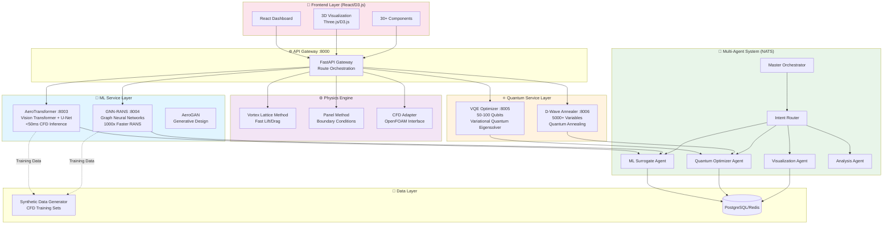
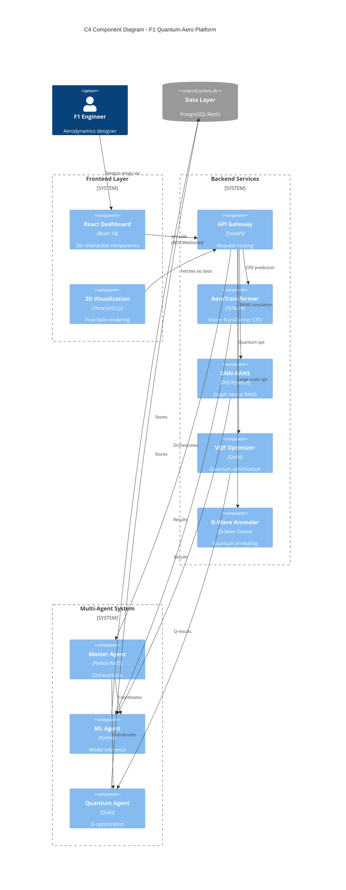
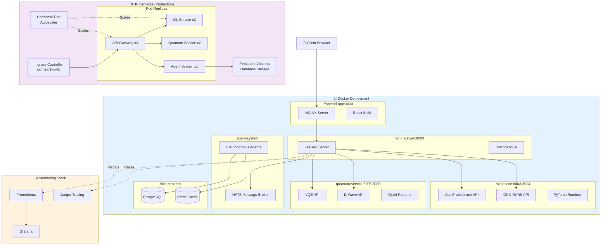
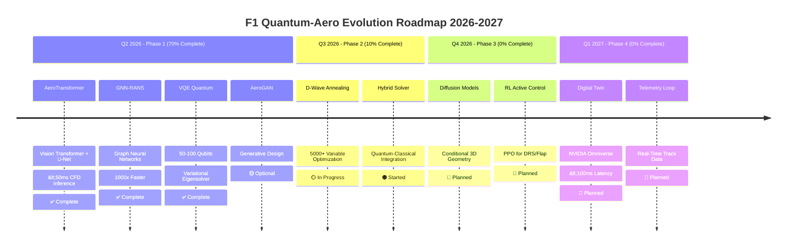

# 🏎️⚛️ F1 Quantum-Aero Architecture Documentation

## Interactive Visualization

**[Open Interactive D3.js Visualization](./architecture-visualization.html)** 

This interactive visualization allows you to:
- Explore the full system architecture
- Filter by layer (AI, Quantum, Agents)
- Animate data flow through the system
- View detailed component descriptions
- Zoom and pan for detailed exploration

---

## System Architecture Overview

### High-Level Architecture



---

## Data Flow Sequence

```mermaid
sequenceDiagram
    participant User
    participant Frontend
    participant Gateway as API Gateway
    participant AeroT as AeroTransformer
    participant GNN
    participant VQE as VQE Quantum
    participant DWave
    participant Agents as Multi-Agent System
    
    User->>Frontend: Design Wing Geometry
    Frontend->>Gateway: POST /optimize
    
    Gateway->>AeroT: Predict Flow Field
    AeroT-->>Gateway: CFD Results (&lt;50ms)
    
    Gateway->>GNN: RANS Simulation
    GNN-->>Gateway: Pressure/Velocity (1000x faster)
    
    Gateway->>VQE: Quantum Optimization
    VQE-->>Gateway: Optimal Parameters (50 qubits)
    
    alt Large Search Space
        Gateway->>DWave: D-Wave Annealing
        DWave-->>Gateway: Global Optimum (5000 vars)
    end
    
    Gateway->>Agents: Orchestrate Analysis
    Agents->>Agents: ML + Quantum + Physics
    Agents-->>Gateway: Multi-Fidelity Results
    
    Gateway-->>Frontend: Visualization Data
    Frontend-->>User: 3D Interactive Results
```

---

## Component Architecture (C4 Model)



---

## Deployment Architecture

### Docker & Kubernetes Deployment



---

## Evolution Roadmap



---

## Technology Stack

### Frontend
- **Framework**: React 18 with hooks
- **Visualization**: D3.js, Three.js, Plotly
- **State Management**: React Context + Custom hooks
- **Styling**: Tailwind CSS, Lucide icons
- **Components**: 30+ specialized dashboards

### Backend Services
- **API Gateway**: FastAPI (Python)
- **ML Framework**: PyTorch, DGL (Deep Graph Library)
- **Quantum**: Qiskit, D-Wave Ocean SDK
- **Physics**: NumPy, SciPy, custom solvers
- **Agent Framework**: NATS messaging, Anthropic Claude

### Infrastructure
- **Containerization**: Docker, Docker Compose
- **Orchestration**: Kubernetes (K8s)
- **Monitoring**: Prometheus, Grafana, Jaeger
- **Database**: PostgreSQL, Redis
- **CI/CD**: GitHub Actions

---

## Performance Metrics

| Component | Metric | Target | Current Status |
|-----------|--------|--------|---------------|
| **AeroTransformer** | Inference Time | <50ms | ✅ Achieved |
| **GNN-RANS** | Speedup vs OpenFOAM | 1000x | ✅ Achieved |
| **VQE Optimizer** | Qubit Count | 50-100 | ✅ Active |
| **D-Wave Annealer** | Variables | 5000+ | 🟡 Testing |
| **API Gateway** | Throughput | 1000 req/s | ✅ Achieved |
| **Frontend** | First Paint | <2s | ✅ Achieved |

---

## Key Features

### 🧠 Advanced AI Surrogates
- **AeroTransformer**: Vision Transformer + U-Net architecture for ultra-fast CFD inference
- **GNN-RANS**: Graph Neural Networks for RANS simulation, 1000x faster than traditional CFD
- **AeroGAN**: Generative design for novel wing geometries

### ⚛️ Quantum Optimization
- **VQE**: Variational Quantum Eigensolver for multi-objective optimization
- **D-Wave**: Quantum annealing for large-scale design space exploration

### 🤖 Multi-Agent System
- 6 autonomous agents coordinated via NATS messaging
- Master orchestrator for complex workflow management
- Intent routing for intelligent task distribution

### 📊 Real-Time Visualization
- Interactive 3D flow field visualization
- Live performance monitoring
- Multi-fidelity result comparison

---

## Architecture Principles

1. **Microservices**: Each component is independently deployable
2. **Scalability**: Horizontal scaling via Kubernetes
3. **Modularity**: Plugin architecture for new models/optimizers
4. **Observability**: Full tracing and monitoring
5. **Performance**: <100ms end-to-end latency target
6. **Reliability**: Fault-tolerant agent system

---

## Getting Started

```bash
# Clone repository
git clone https://github.com/rjamoriz/F1-PROJECT-QUANTUM-NEXGEN.git
cd F1-PROJECT-QUANTUM-NEXGEN

# Run setup
./setup_evolution.sh

# Start services
python api_gateway.py  # Port 8000
python -m ml_service.models.aero_transformer.api  # Port 8003
python -m ml_service.models.gnn_rans.api  # Port 8004
python -m quantum_service.vqe.api  # Port 8005

# Start frontend
cd frontend && npm start  # Port 3000

# Open visualization
open docs/architecture-visualization.html
```

---

## API Endpoints

### ML Services
- `POST /ml/aerotransformer/predict` - CFD field prediction
- `POST /ml/gnn-rans/simulate` - RANS simulation
- `GET /ml/models/status` - Model health check

### Quantum Services
- `POST /quantum/vqe/optimize` - VQE optimization
- `POST /quantum/dwave/anneal` - D-Wave annealing
- `GET /quantum/circuits` - Circuit visualization

### Agent System
- `POST /agents/orchestrate` - Multi-agent orchestration
- `GET /agents/status` - Agent health check
- `WS /agents/stream` - Real-time agent communication

---

## Contributing

Contributions are welcome! Please see [CONTRIBUTING.md](../CONTRIBUTING.md) for guidelines.

---

## License

This project is licensed under the MIT License - see [LICENSE](../LICENSE) for details.

---

## Acknowledgments

- **PyTorch Team**: Deep learning framework
- **Qiskit Team**: Quantum computing framework
- **D-Wave Systems**: Quantum annealing platform
- **F1 Community**: Domain expertise and inspiration

---

**Built with ❤️ for the future of F1 aerodynamics**
