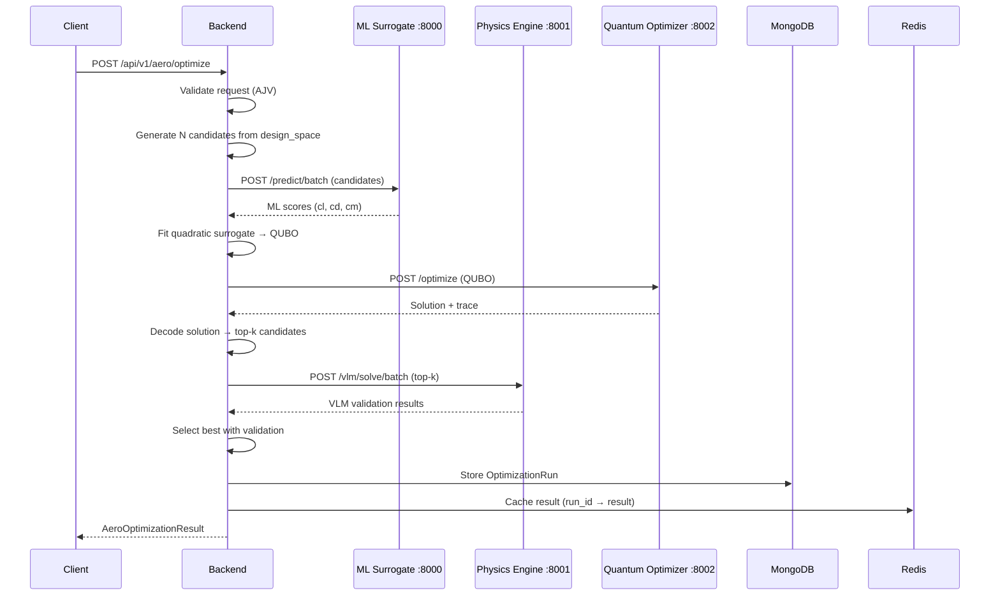

# PLAN: Quantum-Ready Aero Optimization Loop (Q-AERO Implementation Spec)

**Status**: 🟡 In Progress  
**Owner**: Q-AERO Development Team  
**Target Completion**: Q2 2026  
**Priority**: P0 (Architecture Foundation)

---

## 0. Executive Summary

### Goal
Create a **clean, reproducible hybrid quantum-classical aero optimization loop** that:
- Generates discrete aero design candidates (flap angles, profile choices, gurney tabs)
- Scores rapidly via ML surrogate (sub-100ms)
- Fits quadratic surrogate → QUBO formulation
- Optimizes QUBO via QAOA (≤20 vars) or classical fallback (>20 vars)
- Validates top-k candidates with Physics/VLM ground truth
- Stores complete audit trail (MongoDB) + caches hot results (Redis)

### Reality Constraint
Near-term quantum computing (NISQ era) is **best suited for combinatorial design search**, not full high-Reynolds transient CFD. QC acts as a **co-processor** for discrete optimization; always validate against classical/VLM first.

### Current Architecture (Docker Compose Canonical)
```
Port Map (docker-compose.yml):
- Backend (Node.js):        :3001  (services/backend)
- Physics Engine (Python):  :8001  (services/physics-engine)
- ML Surrogate (Python):    :8000  (services/ml-surrogate)
- Quantum Optimizer:        :8002  (services/quantum-optimizer)
- MongoDB:                  :27017
- Redis:                    :6379
- NATS (Agents):            :4222
```

### Critical Issues Identified (OpenAI Review)

| Issue | Impact | Priority |
|-------|--------|----------|
| **Architecture drift**: README/ARCHITECTURE reference old ports (:8003-8006) vs Docker Compose (:8000-8002) | Medium-High | P0 |
| **QAOA correctness**: Manual QUBO→Ising mapping has errors; Sampler() not bound to Aer backend | High | P0 |
| **VLM scaling**: Dense direct solve `np.linalg.solve()` is O(N³), chokes at >500 panels | High | P1 |
| **ML surrogate realism**: Generates pseudo-data from `mesh_id` hash, not real geometry | Medium | P1 |
| **Missing orchestration**: No end-to-end optimization endpoint tying services together | High | P0 |
| **No QUBO validation**: No brute-force tests for n≤16 to verify energy ordering | High | P0 |

---

## 1. Phase 0: Architecture Cleanup (Unify Source of Truth)

### Objective
Make **Docker Compose the canonical runtime**; update all docs to match.

### Tasks

#### 1.1 Update README.md
- ✅ Replace "Quick Start" section:
  - Remove `python api_gateway.py` (port 8000)
  - Remove individual service starts (ports 8003-8005)
  - **New**: `docker compose up --build` as primary method
- ✅ Update port references throughout
- ✅ Add Docker Desktop requirements (4GB+ RAM, WSL2 on Windows)

#### 1.2 Update docs/ARCHITECTURE.md
- ✅ Replace all service port references:
  - AeroTransformer :8003 → ML Surrogate :8000
  - GNN-RANS :8004 → ML Surrogate :8000 (unified)
  - VQE :8005 → Quantum Optimizer :8002
  - D-Wave :8006 → Quantum Optimizer :8002
- ✅ Update Mermaid diagrams to reflect Docker network topology
- ✅ Add "Legacy Ports" section if needed for backwards compatibility notes

#### 1.3 Mark or Remove Legacy Code
- 🔄 Add deprecation warnings in `api_gateway.py` (if retained)
- 🔄 Label old quantum_service/vqe path as "legacy" in comments

**Acceptance Criteria**:  
✅ All docs reference Docker Compose ports consistently  
✅ `docker compose up` starts all services with correct networking  
✅ No port conflicts or references to non-existent ports

---

## 2. Phase 1: Contracts & Schemas (Shared API Truth)

### Objective
Create **typed contracts** for inter-service communication to prevent integration drift.

### Structure
```
/contracts/
  /schemas/          ← JSON Schema definitions
    AeroDesignSpace.schema.json
    AeroOptimizationRequest.schema.json
    AeroOptimizationResult.schema.json
    QuboProblem.schema.json
    CandidateEvaluation.schema.json
    FlowConditions.schema.json
  /examples/         ← Example payloads for testing
    optimization_request_example.json
  README.md          ← Contract versioning & usage guide
```

### Schemas Required

#### 2.1 AeroDesignSpace.schema.json
```json
{
  "$schema": "http://json-schema.org/draft-07/schema#",
  "type": "object",
  "required": ["design_type", "variables"],
  "properties": {
    "design_type": {
      "type": "string",
      "enum": ["front_wing_discrete_v1", "rear_wing_continuous", "floor_edge"]
    },
    "variables": {
      "type": "array",
      "items": {
        "type": "object",
        "required": ["name", "type", "domain"],
        "properties": {
          "name": {"type": "string"},
          "type": {"enum": ["binary", "categorical", "integer", "continuous"]},
          "domain": {
            "oneOf": [
              {"type": "object", "properties": {"min": {"type": "number"}, "max": {"type": "number"}}},
              {"type": "array", "items": {"type": "string"}}
            ]
          },
          "one_hot_group": {"type": "string"}
        }
      }
    }
  }
}
```

#### 2.2 AeroOptimizationRequest.schema.json
```json
{
  "$schema": "http://json-schema.org/draft-07/schema#",
  "type": "object",
  "required": ["design_space", "flow", "objective"],
  "properties": {
    "design_space": {"$ref": "AeroDesignSpace.schema.json"},
    "flow": {"$ref": "FlowConditions.schema.json"},
    "objective": {
      "type": "object",
      "required": ["weights"],
      "properties": {
        "weights": {
          "type": "object",
          "properties": {
            "downforce": {"type": "number", "minimum": 0},
            "drag": {"type": "number", "minimum": 0},
            "balance": {"type": "number", "minimum": 0}
          }
        },
        "constraints": {
          "type": "array",
          "items": {
            "type": "object",
            "required": ["type", "value"],
            "properties": {
              "type": {"enum": ["cl_min", "cd_max", "balance_range"]},
              "value": {"type": "number"}
            }
          }
        }
      }
    },
    "quantum": {
      "type": "object",
      "properties": {
        "p_layers": {"type": "integer", "minimum": 1, "maximum": 10, "default": 3},
        "shots": {"type": "integer", "minimum": 100, "maximum": 100000, "default": 1024},
        "method": {"enum": ["auto", "qaoa", "classical"], "default": "auto"}
      }
    },
    "validation": {
      "type": "object",
      "properties": {
        "top_k": {"type": "integer", "minimum": 1, "maximum": 10, "default": 3},
        "require_vlm": {"type": "boolean", "default": true}
      }
    }
  }
}
```

#### 2.3 QuboProblem.schema.json
```json
{
  "$schema": "http://json-schema.org/draft-07/schema#",
  "type": "object",
  "required": ["n_variables", "Q_matrix"],
  "properties": {
    "n_variables": {"type": "integer", "minimum": 1, "maximum": 100},
    "Q_matrix": {
      "type": "array",
      "items": {
        "type": "array",
        "items": {"type": "number"}
      }
    },
    "linear_terms": {"type": "array", "items": {"type": "number"}},
    "offset": {"type": "number", "default": 0},
    "constraints": {
      "type": "object",
      "properties": {
        "one_hot_groups": {
          "type": "array",
          "items": {
            "type": "array",
            "items": {"type": "integer"}
          }
        }
      }
    }
  }
}
```

### Implementation Tasks

- [ ] Create `/contracts/schemas/` directory
- [ ] Implement all 5 core schemas with examples
- [ ] Add validation in Node backend (AJV library)
- [ ] Add validation in Python services (Pydantic models import JSON Schema)
- [ ] Create `/contracts/examples/` with curl-ready test payloads

**Acceptance Criteria**:  
✅ All schemas validate with JSON Schema Draft-07  
✅ Backend rejects invalid requests with clear error messages  
✅ Python services use Pydantic models matching schemas

---

## 3. Phase 2: QAOA Correctness Fixes (Critical Math)

### Current Issues
1. **Manual QUBO→Ising mapping** (lines 220-250 in `qaoa/solver.py`) has potential off-diagonal term issues
2. **Sampler() not bound to Aer backend** (line 113-115)
3. **No correctness validation** (brute-force tests missing)

### Fixes Required

#### 3.1 Use Qiskit Optimization Converters
**File**: `services/quantum-optimizer/qaoa/solver.py`

Replace manual `_qubo_to_ising()` with:
```python
from qiskit_optimization import QuadraticProgram
from qiskit_optimization.converters import QuadraticProgramToQubo, InequalityToEquality
from qiskit_optimization.translators import from_docplex_mp

def _qubo_to_ising_correct(self, qubo_matrix: np.ndarray) -> SparsePauliOp:
    """Use Qiskit Optimization converters (CORRECT method)"""
    n = qubo_matrix.shape[0]
    
    # Create QuadraticProgram
    qp = QuadraticProgram()
    for i in range(n):
        qp.binary_var(f'x{i}')
    
    # Set QUBO objective: minimize x^T Q x
    qp.minimize(quadratic=qubo_matrix)
    
    # Convert to Ising via Qiskit's proven converters
    from qiskit_optimization.converters import QuadraticProgramToQubo
    converter = QuadraticProgramToQubo()
    qubo_converted = converter.convert(qp)
    
    # Extract Ising Hamiltonian (Qiskit handles mapping)
    hamiltonian, offset = qubo_converted.to_ising()
    return hamiltonian
```

#### 3.2 Bind Sampler to Aer Backend
**File**: `services/quantum-optimizer/qaoa/solver.py`

Replace:
```python
# OLD (WRONG):
qaoa = QAOA(
    sampler=Sampler(),  # ❌ Uses default, ignores self.backend
    optimizer=self.optimizer,
    reps=self.n_layers
)
```

With:
```python
# NEW (CORRECT):
from qiskit_aer.primitives import Sampler as AerSampler

sampler = AerSampler(
    backend=self.backend,
    options={
        "shots": 1024,
        "seed_simulator": 42  # Reproducibility
    }
)

qaoa = QAOA(
    sampler=sampler,
    optimizer=self.optimizer,
    reps=self.n_layers
)
```

#### 3.3 Add QUBO Correctness Unit Tests
**File**: `services/quantum-optimizer/tests/test_qaoa_correctness.py` (NEW)

```python
import pytest
import numpy as np
from qaoa.solver import QAOASolver

def brute_force_qubo(Q: np.ndarray) -> tuple:
    """Brute force all 2^n solutions"""
    n = Q.shape[0]
    best_x = None
    best_energy = np.inf
    
    for i in range(2**n):
        x = np.array([int(b) for b in format(i, f'0{n}b')])
        energy = x @ Q @ x
        if energy < best_energy:
            best_energy = energy
            best_x = x
    
    return best_x, best_energy

@pytest.mark.parametrize("n", [4, 8, 12, 16])
def test_qaoa_energy_ordering_matches_brute_force(n):
    """Verify QAOA Ising energy ordering matches QUBO"""
    solver = QAOASolver(n_layers=2, max_iterations=50)
    
    # Random symmetric QUBO
    Q = np.random.randn(n, n)
    Q = (Q + Q.T) / 2
    
    # Brute force ground truth
    true_solution, true_energy = brute_force_qubo(Q)
    
    # QAOA solution
    result = solver.optimize(Q)
    qaoa_energy = result.solution @ Q @ result.solution
    
    # Energy must match within tolerance
    # (QAOA may not find global optimum, but energy calc must be consistent)
    assert abs(qaoa_energy - (result.solution @ Q @ result.solution)) < 1e-6
    
    # Verify Ising Hamiltonian evaluation matches QUBO
    hamiltonian = solver._qubo_to_ising_correct(Q)
    # (Add Ising evaluation logic here)
```

**Acceptance Criteria**:  
✅ QAOA uses Aer backend with configurable shots/seed  
✅ QUBO→Ising conversion uses qiskit-optimization converters  
✅ All tests pass for n ∈ {4, 8, 12, 16}  
✅ Energy ordering consistency verified

---

## 4. Phase 3: Physics Engine Scale-Up (VLM Performance)

### Current Limitation
**Dense direct solve** `gamma = np.linalg.solve(AIC, rhs)` is **O(N³)** and fails at panel counts >500.

### Improvements

#### 4.1 Add Iterative Solver Mode
**File**: `services/physics-engine/vlm/solver.py`

```python
from scipy.sparse.linalg import gmres, LinearOperator

class VortexLatticeMethod:
    def __init__(self, n_panels_x=20, n_panels_y=10, use_iterative=False):
        self.use_iterative = use_iterative
        self.gmres_tol = 1e-6
        self.gmres_maxiter = 500
    
    def solve(self, velocity, alpha, yaw=0.0, rho=1.225):
        # ... existing code ...
        
        if self.use_iterative:
            # Matrix-free GMRES
            def matvec(gamma_vec):
                return self._compute_induced_velocity_matvec(gamma_vec)
            
            linear_op = LinearOperator(
                shape=(self.n_panels, self.n_panels),
                matvec=matvec
            )
            
            gamma, info = gmres(
                linear_op, 
                rhs,
                tol=self.gmres_tol,
                maxiter=self.gmres_maxiter,
                callback=lambda x: logger.debug(f"GMRES residual: {np.linalg.norm(linear_op @ x - rhs)}")
            )
            
            if info != 0:
                logger.warning(f"GMRES did not converge: info={info}")
        else:
            # Dense direct solve (existing)
            gamma = np.linalg.solve(self.influence_matrix, rhs)
        
        # ... rest of code ...
```

#### 4.2 Ground Effect via Image Vortex Method
**File**: `services/physics-engine/vlm/solver.py`

Add method:
```python
def setup_geometry(self, geometry: WingGeometry, ground_height: Optional[float] = None):
    """
    Args:
        ground_height: Distance to ground plane [m]. If provided, uses image method.
    """
    self.geometry = geometry
    self.ground_height = ground_height
    
    self._generate_panels()
    self._compute_control_points()
    
    if ground_height is not None:
        logger.info(f"Enabling ground effect: height={ground_height}m")
        self._generate_image_panels(ground_height)
    
    self._compute_normals()
    self._build_influence_matrix()
```

#### 4.3 Proper VLM Validation Benchmark
**File**: `services/physics-engine/tests/test_vlm_validation.py` (NEW)

```python
import pytest
from vlm.solver import VortexLatticeMethod, WingGeometry

def test_elliptic_lift_distribution():
    """Validate finite wing lift slope vs lifting-line theory"""
    vlm = VortexLatticeMethod(n_panels_x=30, n_panels_y=40)
    
    # Elliptic wing (AR=6)
    geometry = WingGeometry(span=6.0, chord=1.0, taper_ratio=1.0)
    vlm.setup_geometry(geometry)
    
    result = vlm.solve(velocity=50, alpha=5.0, rho=1.225)
    
    # Lifting line theory: CL_alpha = 2*pi*AR / (AR + 2)
    AR = 6.0
    CL_alpha_theory = 2 * np.pi * AR / (AR + 2)  # per radian
    CL_alpha_vlm = result.cl / np.radians(5.0)
    
    # Should match within 10% (VLM has discretization error)
    assert abs(CL_alpha_vlm - CL_alpha_theory) / CL_alpha_theory < 0.10
```

**Acceptance Criteria**:  
✅ Iterative solver scales to 2000+ panels  
✅ Ground effect option available via API  
✅ VLM validation test passes (finite wing theory)

---

## 5. Phase 4: ML Surrogate Realism (Real Geometry Encoding)

### Current State
`mesh_id` → deterministic hash → pseudo-geometry (scaffolding only)

### Phase 4A: Add Batch Prediction Endpoint
**File**: `services/ml-surrogate/api/server.py`

```python
@app.post("/predict/batch", response_model=List[PredictionResponse])
async def predict_batch(request: BatchPredictionRequest):
    """
    Batch prediction endpoint for optimization loops.
    Processes multiple requests with configurable batch size.
    """
    logger.info(f"Batch prediction: {len(request.requests)} requests, batch_size={request.batch_size}")
    
    results = []
    for i in range(0, len(request.requests), request.batch_size):
        batch = request.requests[i:i+request.batch_size]
        
        # Process batch (reuse existing predict logic)
        batch_results = []
        for req in batch:
            result = await predict(req)  # Reuse single prediction
            batch_results.append(result)
        
        results.extend(batch_results)
    
    logger.info(f"Batch prediction complete: {len(results)} results")
    return results
```

### Phase 4B: Geometry Encoding (Future - After Phase 1)
- Replace `mesh_id` hash with:
  - **Signed Distance Field (SDF)** volumes for CNN input
  - **Point cloud + normals** for Transformer input
  - **Graph adjacency** for GNN-RANS
- Integrate with VLM outputs as training labels

**Acceptance Criteria**:  
✅ `/predict/batch` endpoint functional  
✅ Returns ordered results matching input order  
✅ Response includes decomposed objectives (cl, cd, cm, balance_proxy)

---

## 6. Phase 5: Backend Orchestration Endpoint (The Loop)

### Objective
Create **single endpoint** that orchestrates the full quantum-aero optimization workflow.

### Endpoint Specification
**Route**: `POST /api/v1/aero/optimize`  
**Service**: Node.js Backend (:3001)

### Request Flow


### Implementation
**File**: `services/backend/src/routes/aero.js` (NEW)

```javascript
const express = require('express');
const router = express.Router();
const Ajv = require('ajv');
const { v4: uuidv4 } = require('uuid');
const { createServiceClient } = require('../utils/serviceClient');
const { recordAuditEvent } = require('../models/AuditEvent');
const OptimizationRun = require('../models/OptimizationRun');

// Load JSON Schema contracts
const ajv = new Ajv();
const optimizationRequestSchema = require('../../contracts/schemas/AeroOptimizationRequest.schema.json');
const validateRequest = ajv.compile(optimizationRequestSchema);

// Service clients
const mlClient = createServiceClient('ml-surrogate', process.env.ML_SERVICE_URL, 30000);
const physicsClient = createServiceClient('physics-engine', process.env.PHYSICS_SERVICE_URL, 60000);
const quantumClient = createServiceClient('quantum-optimizer', process.env.QUANTUM_SERVICE_URL, 120000);

router.post('/optimize', async (req, res, next) => {
    const runId = uuidv4();
    const startTime = Date.now();
    
    try {
        // 1. Validate request
        if (!validateRequest(req.body)) {
            return res.status(400).json({
                error: 'Invalid request',
                details: validateRequest.errors
            });
        }
        
        const { design_space, flow, objective, quantum = {}, validation = {} } = req.body;
        
        // 2. Generate candidates from design space
        const candidates = generateCandidates(design_space, 100); // N=100 initial samples
        
        // 3. ML batch scoring
        const mlResponse = await mlClient.post('/predict/batch', {
            requests: candidates.map(c => ({
                mesh_id: c.id,
                parameters: { ...flow, ...c.params },
                use_cache: true,
                return_confidence: true
            })),
            batch_size: 32
        });
        
        const mlScores = mlResponse.data;
        
        // 4. Fit quadratic surrogate → QUBO
        const qubo = fitQuadraticSurrogate(candidates, mlScores, objective);
        
        // 5. Quantum optimization
        const quantumResponse = await quantumClient.post('/optimize', {
            qubo_matrix: qubo.Q,
            n_variables: qubo.n,
            method: quantum.method || 'auto',
            p_layers: quantum.p_layers || 3,
            shots: quantum.shots || 1024
        });
        
        const solution = quantumResponse.data;
        
        // 6. Decode solution to top-k candidates
        const topK = decodeSolutionToTopK(solution, candidates, validation.top_k || 3);
        
        // 7. VLM validation
        let vlmResults = [];
        if (validation.require_vlm !== false) {
            const vlmResponse = await physicsClient.post('/vlm/solve/batch', {
                requests: topK.map(c => ({
                    geometry: c.geometry,
                    velocity: flow.velocity,
                    alpha: flow.alpha,
                    yaw: flow.yaw || 0,
                    rho: flow.rho || 1.225
                }))
            });
            vlmResults = vlmResponse.data;
        }
        
        // 8. Select best with validation
        const final = selectBestWithValidation(topK, mlScores, vlmResults, objective);
        
        // 9. Store run
        const optimizationRun = new OptimizationRun({
            runId,
            request: req.body,
            candidates: candidates.length,
            mlScores,
            qubo,
            quantumSolution: solution,
            vlmValidation: vlmResults,
            result: final,
            computeTimeMs: Date.now() - startTime,
            timestamp: new Date()
        });
        
        await optimizationRun.save();
        
        // 10. Audit log
        await recordAuditEvent({
            event_type: 'aero_optimization_complete',
            user_id: req.user?.id || 'anonymous',
            resource_id: runId,
            metadata: {
                n_candidates: candidates.length,
                quantum_method: solution.method,
                compute_time_ms: Date.now() - startTime
            }
        });
        
        res.json({
            success: true,
            runId,
            result: final,
            metadata: {
                n_candidates_generated: candidates.length,
                n_ml_evaluated: mlScores.length,
                n_vlm_validated: vlmResults.length,
                quantum_method: solution.method,
                compute_time_ms: Date.now() - startTime
            }
        });
        
    } catch (error) {
        logger.error(`Optimization failed: ${error.message}`, { runId, error: error.stack });
        next(error);
    }
});

// Helper: Generate discrete candidates from design space
function generateCandidates(designSpace, n) {
    // TODO: Implement based on design_space.variables
    // For "choose 1 of K" categorical, sample uniformly
    // For binary, sample {0,1}
    // Return array of {id, params, geometry} objects
    return [];
}

// Helper: Fit quadratic QUBO from ML scores
function fitQuadraticSurrogate(candidates, scores, objective) {
    // TODO: Fit quadratic model: f(x) = x^T Q x + c^T x
    // Incorporate objective weights (downforce vs drag vs balance)
    // Add penalty terms for constraints (one-hot groups)
    return { Q: [], n: 0 };
}

// Helper: Decode binary solution to top-k design candidates
function decodeSolutionToTopK(solution, candidates, k) {
    // TODO: Map binary vector back to design parameters
    // Return top-k by objective score
    return [];
}

// Helper: Select best considering ML vs VLM delta
function selectBestWithValidation(topK, mlScores, vlmResults, objective) {
    // TODO: Penalize candidates with large ML-VLM disagreement
    // Return final chosen design
    return {};
}

module.exports = router;
```

### MongoDB Model
**File**: `services/backend/src/models/OptimizationRun.js` (NEW)

```javascript
const mongoose = require('mongoose');

const optimizationRunSchema = new mongoose.Schema({
    runId: { type: String, required: true, unique: true, index: true },
    request: { type: Object, required: true },
    candidates: { type: Number, required: true },
    mlScores: { type: Array, required: true },
    qubo: { type: Object, required: true },
    quantumSolution: { type: Object, required: true },
    vlmValidation: { type: Array, default: [] },
    result: { type: Object, required: true },
    computeTimeMs: { type: Number, required: true },
    timestamp: { type: Date, default: Date.now, index: true }
}, { 
    collection: 'optimization_runs',
    timestamps: true 
});

module.exports = mongoose.model('OptimizationRun', optimizationRunSchema);
```

**Acceptance Criteria**:  
✅ Full optimization run completes via single API call  
✅ Results stored in MongoDB with complete audit trail  
✅ Top-k VLM validation occurs automatically  
✅ Response includes metadata (timings, method used, candidate counts)

---

## 7. Phase 6: F1-Relevant Design Space (Discrete Front Wing)

### Design Space: Front Wing Discrete V1

```json
{
  "design_type": "front_wing_discrete_v1",
  "variables": [
    {
      "name": "main_profile",
      "type": "categorical",
      "domain": ["NACA4412", "NACA6412", "S1223", "E423", "Custom_High_CL"],
      "one_hot_group": "profile_choice"
    },
    {
      "name": "flap_angle_bin",
      "type": "categorical",
      "domain": ["0deg", "5deg", "10deg", "15deg", "20deg", "25deg"],
      "one_hot_group": "flap_angle"
    },
    {
      "name": "gurney_flap",
      "type": "binary",
      "domain": [0, 1]
    },
    {
      "name": "endplate_louvers",
      "type": "categorical",
      "domain": ["none", "2_louvers", "4_louvers", "6_louvers"],
      "one_hot_group": "louver_config"
    },
    {
      "name": "slot_gap_bin",
      "type": "categorical",
      "domain": ["tight", "medium", "wide"],
      "one_hot_group": "slot_gap"
    }
  ]
}
```

### QUBO Encoding
- **One-hot groups**: Add penalty `P * (sum(x_i) - 1)^2` for each group
- **Binary objectives**: Quadratic surrogate from ML scores:
  - `Q[i,j]` captures interaction between variable i and j
  - Fit via least-squares regression on sampled ML evaluations

**Acceptance Criteria**:  
✅ Design space JSON validates against schema  
✅ Candidate generator produces valid one-hot encodings  
✅ QUBO penalties enforce one-hot constraints

---

## 8. Phase 7: Integration Tests & Acceptance

### Test Suite

#### 8.1 Unit Tests (Per Service)
- **QAOA**: Brute-force correctness (n≤16)
- **VLM**: Finite wing validation vs lifting-line theory
- **ML Surrogate**: Batch endpoint ordering verification

#### 8.2 Integration Tests (Docker Compose)
**File**: `tests/integration/test_optimization_loop.py` (NEW)

```python
import requests
import pytest

BASE_URL = "http://localhost:3001/api/v1"

def test_end_to_end_optimization():
    """Full optimization run via backend orchestration"""
    
    request_payload = {
        "design_space": {
            "design_type": "front_wing_discrete_v1",
            "variables": [
                {"name": "flap_angle_bin", "type": "categorical", "domain": ["0deg", "10deg", "20deg"], "one_hot_group": "flap"}
            ]
        },
        "flow": {
            "velocity": 50,
            "alpha": 3.0,
            "yaw": 0,
            "rho": 1.225
        },
        "objective": {
            "weights": {"downforce": 0.7, "drag": 0.3}
        },
        "quantum": {
            "method": "auto",
            "p_layers": 2,
            "shots": 512
        },
        "validation": {
            "top_k": 2,
            "require_vlm": True
        }
    }
    
    response = requests.post(f"{BASE_URL}/aero/optimize", json=request_payload, timeout=180)
    
    assert response.status_code == 200
    data = response.json()
    
    assert data["success"] is True
    assert "runId" in data
    assert "result" in data
    assert data["metadata"]["n_vlm_validated"] == 2
    assert data["metadata"]["quantum_method"] in ["qaoa", "classical"]
    
    # Verify run stored in DB
    run_id = data["runId"]
    run_response = requests.get(f"{BASE_URL}/aero/runs/{run_id}")
    assert run_response.status_code == 200
```

**Acceptance Criteria**:  
✅ One command (`docker compose up`) starts full stack  
✅ End-to-end test completes in <3 minutes  
✅ Results include validation deltas (ML vs VLM)  
✅ Run ID retrieval returns full audit trail

---

## 9. Phase 8: Documentation & Runbook

### Required Documentation

#### 9.1 RUN_OPTIMIZATION.md
**File**: `docs/RUN_OPTIMIZATION.md` (NEW)

```markdown
# Running Aero Optimization

## Quick Start

### 1. Start Services
```bash
docker compose up --build
```

### 2. Run Optimization
```bash
curl -X POST http://localhost:3001/api/v1/aero/optimize \
  -H "Content-Type: application/json" \
  -d @contracts/examples/optimization_request_example.json
```

### 3. Retrieve Run
```bash
curl http://localhost:3001/api/v1/aero/runs/{run_id}
```

## Design Spaces Available
- `front_wing_discrete_v1`: Flap angles, profiles, gurney tabs
- (More to come: rear wing, floor edge, suspension geometry)

## Validation
- ML surrogate: <100ms per candidate
- VLM validation: ~2s per geometry
- QAOA (n≤20): ~10-30s
- Classical fallback (n>20): <5s
```

#### 9.2 Update ARCHITECTURE.md
- Add "Quantum-Ready Loop" section with Mermaid sequence diagram
- Document service contracts & ports
- Add troubleshooting guide

**Acceptance Criteria**:  
✅ Runbook validated with fresh Docker environment  
✅ Example curl commands work without modification  
✅ Architecture diagram reflects optimization loop

---

## 10. Success Metrics & Definition of Done

### Technical DoD
- [ ] ✅ All services start with `docker compose up`
- [ ] ✅ End-to-end optimization completes successfully
- [ ] ✅ QAOA results reproducible (seeded)
- [ ] ✅ QUBO correctness tests pass (n ∈ {4,8,12,16})
- [ ] ✅ VLM validation test passes (finite wing theory)
- [ ] ✅ Backend returns stored run ID
- [ ] ✅ `GET /api/v1/aero/runs/:id` retrieves full audit trail
- [ ] ✅ All contracts validate with JSON Schema
- [ ] ✅ Integration test passes in CI

### Performance Targets (Phase 1)
- ML batch prediction (100 candidates): <3s
- QAOA solve (n=16): <30s
- VLM validation (3 geometries): <10s
- Full optimization loop: <3 minutes

### Documentation DoD
- [ ] ✅ README Quick Start uses Docker Compose
- [ ] ✅ All port references consistent
- [ ] ✅ RUN_OPTIMIZATION.md with working curl examples
- [ ] ✅ Contract schemas with examples

---

## 11. Roadmap Beyond Phase 1 (Future Quantum-CFD Integration)

### Phase 2: ROM + VQLS (Quantum Linear Solvers)
**When**: After Phase 1 stable (Q3 2026)

- Build Reduced-Order Model (POD/Galerkin) from VLM/OpenFOAM runs
- Target ROM size: 100-1000 DOF (NISQ-feasible)
- Use **Variational Quantum Linear Solver (VQLS)** for pressure-Poisson blocks
- **Validation requirement**: Classical residual norms must match; always compare vs classical preconditioned GMRES

### Phase 3: OpenFOAM Integration + Active Learning
**When**: Q4 2026

- Add OpenFOAM adapter service (:8003)
- Use VLM + ML to select high-value OpenFOAM runs (active learning)
- QC used for design space exploration (discrete), not full CFD solve
- **Reality check**: Full transient CFD remains classical; QC assists in design downselection only

---

## 12. Implementation Workflow (VS Code Copilot Prompts)

### Prompt Sequence for Copilot

Copy-paste these prompts sequentially into Copilot Chat:

#### Prompt 1: Contracts
```
Create JSON Schemas for AeroOptimizationRequest, AeroOptimizationResult, QuboProblem, and AeroDesignSpace in /contracts/schemas/. 
Include strict types, required fields, and example payloads in /contracts/examples/. 
Follow JSON Schema Draft-07 spec.
```

#### Prompt 2: Backend Route
```
In services/backend/src/routes, create aero.js with POST /optimize endpoint. 
Validate requests using AJV against contracts/schemas/AeroOptimizationRequest.schema.json. 
Implement orchestration: call ML /predict/batch, quantum /optimize, physics /vlm/solve/batch. 
Use createServiceClient from utils/serviceClient.js. 
Return run ID and store in MongoDB OptimizationRun model.
```

#### Prompt 3: QAOA Fixes
```
In services/quantum-optimizer/qaoa/solver.py, refactor _qubo_to_ising() to use qiskit_optimization.QuadraticProgram and converters. 
Update optimize() method to use AerSampler(backend=self.backend) with configurable shots/seed. 
Add unit test in tests/test_qaoa_correctness.py that brute-forces QUBO for n≤16 and compares energy.
```

#### Prompt 4: Physics Batch Endpoint
```
In services/physics-engine/api/server.py, add POST /vlm/solve/batch that accepts a list of SimulationRequests and returns a list of AeroResponse. 
Reuse existing VLM solver logic. Process sequentially with progress logging.
```

#### Prompt 5: ML Batch Endpoint
```
In services/ml-surrogate/api/server.py, implement POST /predict/batch using BatchPredictionRequest schema. 
Process in configurable batches (batch_size parameter). 
Reuse existing predict() logic and cache. 
Return ordered results matching input order.
```

#### Prompt 6: VLM Iterative Solver
```
In services/physics-engine/vlm/solver.py, add use_iterative parameter to __init__. 
If True, use scipy.sparse.linalg.gmres with matrix-free LinearOperator instead of np.linalg.solve. 
Implement _compute_induced_velocity_matvec() method for matrix-vector product.
```

#### Prompt 7: Documentation Update
```
Update README.md Quick Start to use docker compose up as primary method. 
Remove references to python api_gateway.py and individual service ports 8003-8005. 
Update docs/ARCHITECTURE.md to reflect Docker Compose ports (ML :8000, Physics :8001, Quantum :8002). 
Add RUN_OPTIMIZATION.md with curl examples for /api/v1/aero/optimize.
```

---

## 13. Open Questions & Decisions Required

| Question | Options | Decision Owner | Deadline |
|----------|---------|----------------|----------|
| **QUBO penalty weight** for one-hot constraints? | 10x, 100x, adaptive | Quantum team | Before Phase 6 |
| **Initial candidate count** N for ML scoring? | 50, 100, 200 | Backend team | Before Phase 5 |
| **VLM panel density** for validation runs? | 20×10, 40×20, 60×30 | Physics team | Before Phase 4 |
| **Quadratic surrogate fitting** method? | Least-squares, ridge regression, neural quadratic | ML team | Before Phase 5 |
| **Redis cache TTL** for ML predictions? | 1h, 24h, 7d | Backend team | Before Phase 5 |

---

## 14. Risk Register

| Risk | Impact | Mitigation |
|------|--------|------------|
| **QAOA doesn't find global optimum** (nature of heuristic) | Medium | Always validate top-k with VLM; use classical fallback for n>20 |
| **ML surrogate has poor accuracy** (pseudo-data currently) | High | Phase 4B real geometry encoding; continuous retraining with VLM labels |
| **VLM validation too slow** for real-time loop | Medium | Use iterative solver; cache common geometries; consider GPU acceleration |
| **QUBO size exceeds 20 variables** (QAOA limit) | Low | Classical fallback already implemented; consider D-Wave for larger problems |
| **Network latency** between Docker services | Low | Use Docker Compose networks; consider Redis pub/sub for async workflows |

---

## Appendix A: File Checklist

### New Files to Create
```
contracts/
  schemas/
    AeroDesignSpace.schema.json
    AeroOptimizationRequest.schema.json  
    AeroOptimizationResult.schema.json
    QuboProblem.schema.json
    CandidateEvaluation.schema.json
    FlowConditions.schema.json
  examples/
    optimization_request_example.json
  README.md

services/backend/src/
  routes/
    aero.js
  models/
    OptimizationRun.js

services/quantum-optimizer/
  tests/
    test_qaoa_correctness.py

services/physics-engine/
  tests/
    test_vlm_validation.py

tests/integration/
  test_optimization_loop.py

docs/
  RUN_OPTIMIZATION.md
  PLAN_QUANTUM_READY_LOOP.md  (this file)
```

### Files to Modify
```
README.md
docs/ARCHITECTURE.md
services/quantum-optimizer/qaoa/solver.py
services/physics-engine/vlm/solver.py
services/physics-engine/api/server.py
services/ml-surrogate/api/server.py
services/backend/app.js  (mount aero.js route)
docker-compose.yml  (if needed for env vars)
```

---

**Last Updated**: 2026-02-16  
**Status**: 🟡 Ready for Implementation  
**Next Action**: Begin Phase 0 (Architecture Cleanup)
