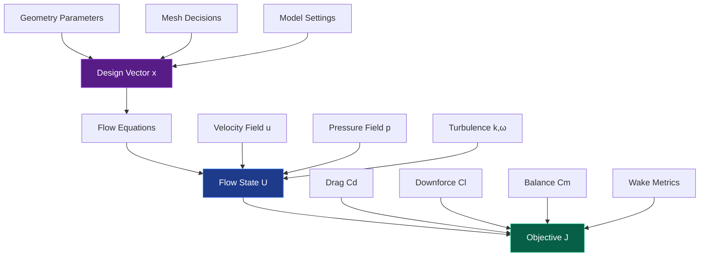
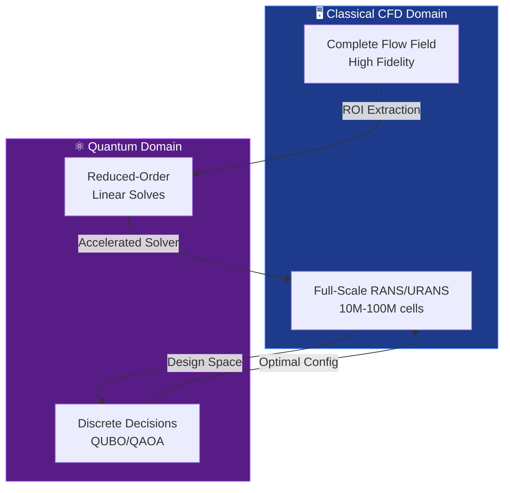
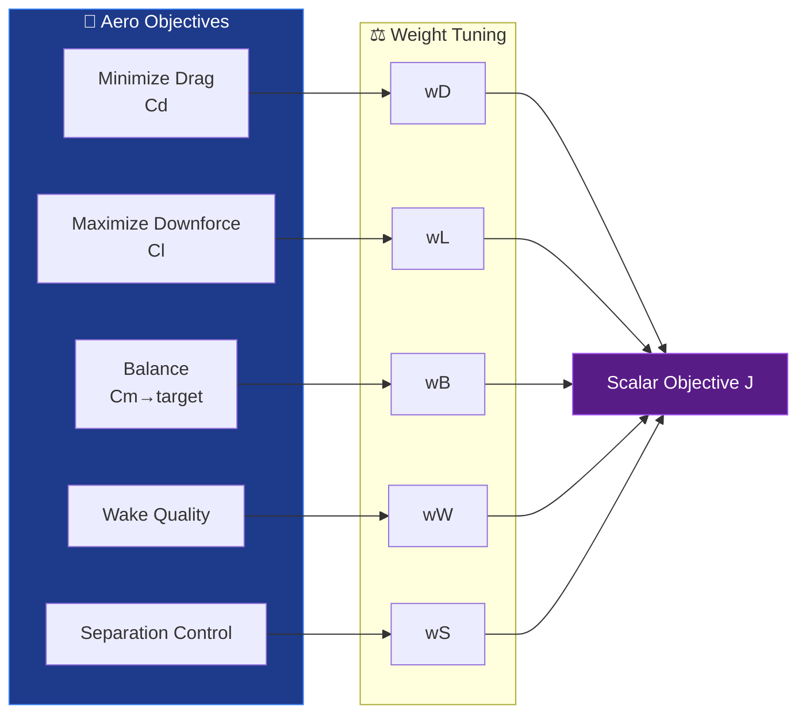
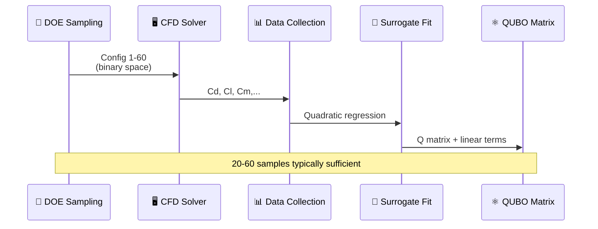
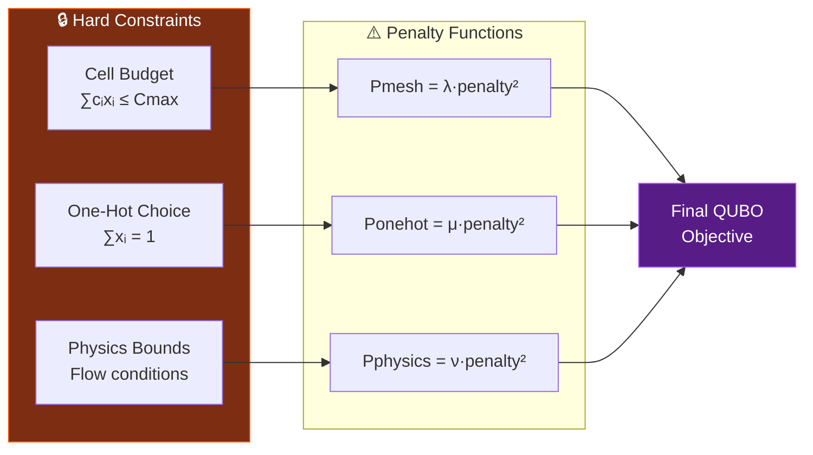
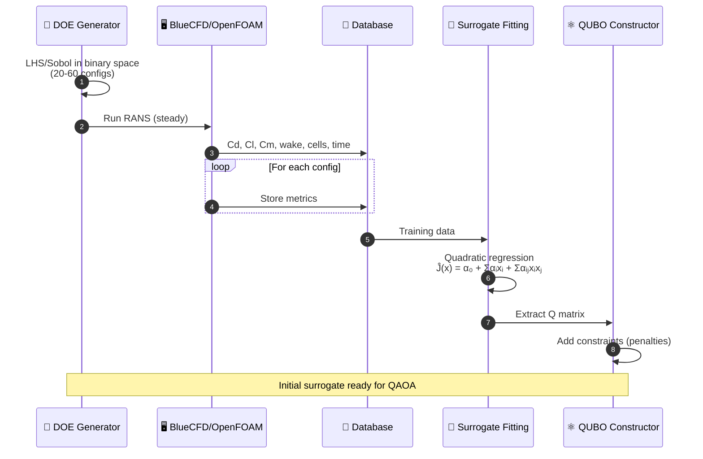
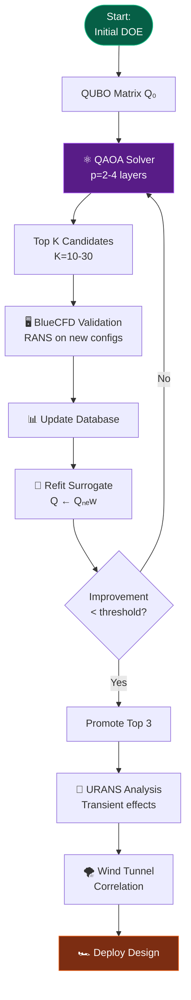

# Quantum Definition of an F1 CFD Optimization Problem (BlueCFD/OpenFOAM → QUBO/Ising/QAOA)

> **Q-AERO** — Quantum Aerodynamics Expert for Racing Optimization  
> Goal: translate an **STL → mesh/patches → RANS/URANS** CFD workflow (BlueCFD/OpenFOAM) into **quantum-ready optimization** formulations: **QUBO / Ising / QAOA**, plus (optionally) **VQLS / Iterative-QLS / VQE-style** acceleration for reduced linear solves.

---

## Table of Contents
- [1. The Core Mathematical Problem](#1-the-core-mathematical-problem)
- [2. What Maps Cleanly to QUBO/QAOA](#2-what-maps-cleanly-to-quboqaoa)
- [3. Building the QUBO Objective](#3-building-the-qubo-objective)
- [4. QUBO ↔ Ising Mapping (for QAOA)](#4-qubo--ising-mapping-for-qaoa)
- [5. Where Navier–Stokes Discretization Fits Quantum (and where it doesn’t)](#5-where-navierstokes-discretization-fits-quantum-and-where-it-doesnt)
- [6. BlueCFD/OpenFOAM → Quantum Workflow Blueprint](#6-bluecfdopenfoam--quantum-workflow-blueprint)
- [7. Concrete Example: Mesh/Patch Allocation as QUBO](#7-concrete-example-meshpatch-allocation-as-qubo)
- [8. Minimal Qiskit Skeleton (QAOA)](#8-minimal-qiskit-skeleton-qaoa)
- [9. Validation Gates (Non-Negotiable)](#9-validation-gates-non-negotiable)
- [10. Mermaid Visualizations](#10-mermaid-visualizations)

---

## 1. The Core Mathematical Problem

CFD-based aero optimization is naturally a **PDE-constrained optimization** problem:

$$
\min_{x}\; J(U(x)) \quad\text{subject to}\quad R(U,x)=0
$$

### Mathematical Components



#### Variable Definitions

| Symbol | Description | Domain |
|--------|-------------|---------|
| $x$ | **Design vector** | Geometry/setup/mesh/model decisions (discrete) |
| $U$ | **Flow state** | Velocity $\mathbf{u}$, pressure $p$, turbulence $(k,\omega)$ |
| $R(U,x)=0$ | **Residual** | Discretized Navier–Stokes + turbulence + BC |
| $J$ | **Objective** | $C_d$ (drag), $C_l$ (downforce), $C_m$ (balance), wake loss |

### 🎯 Quantum Strategy

> **Critical Insight**: Don't attempt to "quantize the entire CFD field" at full scale!



**Approach:**
1. ⚛️ Use **QUBO/QAOA** for **discrete design/mesh choices**
2. 🔬 Optionally use **quantum linear-solver methods** (VQLS/QLS/VQE) for **reduced-order** linear solves

---

## 2. What Maps Cleanly to QUBO/QAOA

### 2.1 Discrete geometry & setup choices (high ROI)
Even from an STL, you can build **libraries** and **binned parameters**:

- Front wing flap angle: {10°, 12°, 14°, 16°}
- Gurney: {0, 2 mm, 4 mm}
- Diffuser edge treatment: {A, B, C}
- Floor strake count: {3, 4, 5}
- Ride height bin: {low, mid, high}
- 2026+ **active aero** mode schedule: discrete states per speed band

Encode these as binary variables (one-hot or binary encoding).

### 2.2 Mesh & patch decisions (very QUBO-friendly)
This directly matches “optimize patches and mesh use number”:

- Zone refinement toggles around patches:
  - frontWing_LE, floor_throat, diffuser, rearWing_TE, wheel_wake, sidepod_undercut, wakeBox, etc.
- Boundary-layer settings as discrete choices:
  - layer count {15, 25, 35}
  - growth ratio {1.15, 1.2}
  - y\(^+\) target bins

---

## 3. Building the QUBO Objective

### 3.1 Multi-Objective Scalarization



**Scalarized Objective Function:**

$$
J(x) = w_D\,C_d - w_L\,C_l + w_B\,|C_m - C_{m,\text{target}}| + w_W\,\Phi_{\text{wake}} + w_S\,\Psi_{\text{sep}}
$$

**Wake Metrics** $\Phi_{\text{wake}}$ (post-processing planes/boxes):

$$
\begin{aligned}
\Phi_1 &= \int_A (p_{t,\infty}-p_t)\,dA && \text{[Total pressure loss]}\\
\Phi_2 &= \int_V \text{TKE}\,dV && \text{[Turbulent kinetic energy]}\\
\Phi_3 &= \int_A |\omega|\,dA && \text{[Vorticity magnitude]}
\end{aligned}
$$

### 3.2 CFD Metrics → Quadratic Surrogate (Critical Step)



**QUBO Standard Form:**

$$
\min_{x\in\{0,1\}^n}\; x^\top Q x + q^\top x + c
$$

**Surrogate Model Construction:**

$$
\widehat{J}(x) = \alpha_0 + \sum_{i=1}^n \alpha_i x_i + \sum_{i<j} \alpha_{ij} x_i x_j
$$

Where:
- $\alpha_0$ → constant $c$
- $\alpha_i$ → linear coefficients $q_i$
- $\alpha_{ij}$ → quadratic coupling $Q_{ij}$

### 3.3 Constraints as Quadratic Penalties



**Cell Budget Constraint:**

$$
\sum_{i=1}^n c_i x_i \le C_{\max} \quad\Rightarrow\quad P_{\text{mesh}} = \lambda\left(\sum_i c_i x_i - C_{\max}\right)^2
$$

**One-Hot Encoding** (select exactly one from group $G$):

$$
\sum_{i\in G} x_i = 1 \quad\Rightarrow\quad P_{\text{onehot}} = \mu\left(\sum_{i\in G} x_i - 1\right)^2
$$

**Complete Penalized Objective:**

$$
\boxed{J_{\text{QUBO}}(x) = x^\top Q x + q^\top x + \sum_k \lambda_k P_k(x)}
$$

---

## 4. QUBO ↔ Ising Mapping (for QAOA)

### 4.1 Binary-to-Spin Transformation

```mermaid
graph LR
    subgraph Binary["💾 Binary Domain"]
        B1[x₁ ∈ {0,1}]
        B2[x₂ ∈ {0,1}]
        B3[xₙ ∈ {0,1}]
    end
    
    subgraph Transform["🔄 Mapping"]
        T[xᵢ = (1-sᵢ)/2]
    end
    
    subgraph Spin["⚛️ Spin Domain"]
        S1[s₁ ∈ {-1,+1}]
        S2[s₂ ∈ {-1,+1}]
        S3[sₙ ∈ {-1,+1}]
    end
    
    B1 --> T
    B2 --> T
    B3 --> T
    T --> S1
    T --> S2
    T --> S3
    
    style Binary fill:#1e3a8a,stroke:#3b82f6,color:#fff
    style Spin fill:#581c87,stroke:#a855f7,color:#fff
```

**Transformation Formula:**

$$
\boxed{x_i = \frac{1-s_i}{2}} \quad\Leftrightarrow\quad \boxed{s_i = 1 - 2x_i}
$$

| Binary $x_i$ | Spin $s_i$ | Quantum State |
|--------------|------------|---------------|
| 0 | +1 | $\|0\rangle$ |
| 1 | -1 | $\|1\rangle$ |

### 4.2 Ising Hamiltonian Construction

**QUBO form** → **Ising Hamiltonian:**

$$
\boxed{H_C = \sum_{i=1}^n h_i Z_i + \sum_{i<j}^n J_{ij} Z_i Z_j}
$$

Where:
- $Z_i$ = Pauli-Z operator on qubit $i$
- $h_i$ = local field coefficients (from linear terms)
- $J_{ijBinary Decision Vector Architecture

```mermaid
graph TB
    subgraph X["🎯 Decision Vector x"]
        direction TB
        
        subgraph Geo["Geometry/Setup"]
            G1[Flap Angles<br/>4 options × 3 wings]
            G2[Gurney Height<br/>3 options × 2 wings]
            G3[Diffuser Edge<br/>3 variants]
            G4[Ride Height<br/>3 bins]
            G5[Active Aero 2026+<br/>Speed schedules]
        end
        
        subgraph Mesh["Mesh/Patches"]
            M1[Refinement Zones<br/>7 toggles]
            M2[BL Layer Count<br/>3 options × 5 patches]
            M3[y⁺ Targets<br/>3 bins × 5 patches]
        end
        
        subgraph Model["Model Settings"]
            S1[Turbulence Model<br/>k-ω SST variants]
            S2[Numerical Schemes<br/>Bounded/Unbounded]
        end
    end
    
    Geo --> Binary[Binary Encoding<br/>x ∈ {0,1}ⁿ]
    Mesh --> Binary
    Model --> Binary
    
    Binary --> Total[Total: n=40-80<br/>binary variables]
    
    style Geo fill:#1e3a8a,stroke:#3b82f6,color:#fff
    style Mesh fill:#065f46,stroke:#10b981,color:#fff
### 7.1 Problem Formulation

```mermaid
graph TB
    subgraph Zones["🔍 Refinement Zones"]
        Z1[Zone 1: frontWing_LE<br/>b₁=8, c₁=500k cells]
        Z2[Zone 2: floor_throat<br/>b₂=10, c₂=800k cells]
        Z3[Zone 3: diffuser<br/>b₃=9, c₃=700k cells]
        Z4[Zone 4: rearWing_TE<br/>b₄=6, c₄=400k cells]
        Z5[Zone 5: wheel_wake<br/>b₅=7, c₅=600k cells]
        Z6[Zone 6: sidepod<br/>b₆=5, c₆=300k cells]
        Z7[Zone 7: wakeBox<br/>b₇=4, c₇=200k cells]
    end
    
    Z1 --> Opt[Optimization Problem]
    Z2 --> Opt
    Z3 --> Opt
    Z4 --> Opt
    Z5 --> Opt
    Z6 --> Opt
    Z7 --> Opt
    
    Opt --> Obj[Maximize: Σbᵢxᵢ<br/>Subject to: Σcᵢxᵢ ≤ 2.5M]
    Obj --> QUBO[Convert to QUBO]
    
    style Zones fill:#1e3a8a,stroke:#3b82f6,color:#fff
    style QUBO fill:#581c87,stroke:#a855f7,color:#fff
```

**Zone Parameters:**

| Zone $i$ | Description | Benefit $b_i$ | Cost $c_i$ (kcells) |
|----------|-------------|---------------|---------------------|
| 1 | `frontWing_LE` | 8.0 | 500 |
| 2 | `floor_throat` | 10.0 | 800 |
| 3 | `diffuser` | 9.0 | 700 |
| 4 | `rearWing_TE` | 6.0 | 400 |
| 5 | `wheel_wake` | 7.0 | 600 |
| 6 | `sidepod_undercut` | 5.0 | 300 |
| 7 | `wakeBox` | 4.0 | 200 |

### 7.2 Mathematical Formulation

**Objective:** Maximize fidelity gain under cell budget

$$
\boxed{
\begin{aligned}
\max_{x \in \{0,1\}^7} \quad & \sum_{i=1}^7 b_i x_i \\
\text{subject to} \quad & \sum_{i=1}^7 c_i x_i \le C_{\max}
\end{aligned}
}
$$

Where $C_{\max} = 2{,}500{,}000$ cells (budget)

### 7.3 QUBO Conversion

**Step 1:** Convert maximization to minimization

$$
\min_x \; -\sum_{i=1}^7 b_i x_i
$$

**Step 2:** Add quadratic penalty for constraint

$$
\min_x \; \underbrace{-\sum_{i=1}^7 b_i x_i}_{\text{Linear objective}} + \underbrace{\lambda\left(\sum_{i=1}^7 c_i x_i - C_{\max}\right)^2}_{\text{Quadratic penalty}}
$$

**Step 3:** Expand penalty term

$$
\begin{aligned}
&\left(\sum_i c_i x_i - C_{\max}\right)^2 \\
&= \sum_i c_i^2 x_i^2 + \sum_{i \neq j} c_i c_j x_i x_j - 2C_{\max}\sum_i c_i x_i + C_{\max}^2 \\
&= \sum_i c_i^2 x_i + \sum_{i < j} 2c_i c_j x_i x_j - 2C_{\max}\sum_i c_i x_i + C_{\max}^2 \quad (x_i^2 = x_i)
\end{aligned}
$$

**Final QUBO Form:**

$$
\boxed{
\begin{aligned}
J_{\text{QUBO}}(x) &= \sum_{i=1}^7 \underbrace{\left(-b_i + \lambda c_i^2 - 2\lambda C_{\max} c_i\right)}_{q_i} x_i \\
&\quad + \sum_{i<j} \underbrace{2\lambda c_i c_j}_{Q_{ij}} x_i x_j + \lambda C_{\max}^2
\end{aligned}
}
$$

### 7.4 Numerical Example

With $\lambda = 0.001$, $C_{\max} = 2500$:

```mermaid
graph TD
    Input[Input Parameters<br/>b, c, λ, Cmax] --> Compute[Compute QUBO<br/>Coefficients]
    
    Compute --> Q[Q Matrix 7×7<br/>Upper triangular]
    Compute --> q[Linear vector q<br/>Length 7]
    
    Q --> Solver[⚛️ QAOA/Annealer]
    q --> Solver
    
    Solver --> Optimal[Optimal x*<br/>e.g., [1,1,1,0,1,0,0]]
    Optimal --> Interpret[Selected Zones:<br/>1,2,3,5]
    
    Interpret --> Valid{Total cells<br/>≤ 2.5M?}
    Valid -->|Yes| Deploy[✓ Deploy Mesh]
    Valid -->|No| Adjust[Adjust λ]
    Adjust --> Compute
    
    style Input fill:#1e3a8a,stroke:#3b82f6,color:#fff
    style Solver fill:#581c87,stroke:#a855f7,color:#fff
    style Deploy fill:#065f46,stroke:#10b981,color:#fff
```

**Solution Interpretation:**

If QAOA returns $x^* = [1,1,1,0,1,0,0]$:

- ✅ Refine: `frontWing_LE`, `floor_throat`, `diffuser`, `wheel_wake`
- ❌ Skip: `rearWing_TE`, `sidepod_undercut`, `wakeBox`
- 📊 Total cells: $500 + 800 + 700 + 600 = 2{,}600$ kcells
- 🎯 Total benefit: $8 + 10 + 9 + 7 = 34$
$$

### 6.2 DOE → Surrogate → QUBO Pipeline



**Surrogate Fitting:**

$$
\widehat{J}(x) = \alpha_0 + \sum_{i=1}^n \alpha_i x_i + \sum_{i<j} \alpha_{ij} x_i x_j + \text{penalties}
$$

**Data Collection:**

| Config | $C_d$ | $C_l$ | $C_m$ | Wake | Cells | Time |
|--------|-------|-------|-------|------|-------|------|
| 1 | 0.352 | 3.42 | -0.05 | 1.23 | 4.2M | 45min |
| ... | ... | ... | ... | ... | ... | ... |
| 60 | 0.348 | 3.51 | -0.02 | 1.15 | 5.1M | 52min |

### 6.3 Active Learning Loop



**Iteration Protocol:**

$$
\begin{aligned}
&\text{Iteration } k: \\
&\quad 1.\; \text{Solve QUBO with } Q_k \text{ via QAOA} \\
&\quad 2.\; \text{Validate top } K \text{ designs with CFD} \\
&\quad 3.\; \text{Append to database: } \mathcal{D}_{k+1} = \mathcal{D}_k \cup \{(x_i, J_i)\}_{i=1}^K \\
&\quad 4.\; \text{Refit surrogate: } Q_{k+1} = \text{fit}(\mathcal{D}_{k+1}) \\
&\quad 5.\; \text{Check convergence: } \Delta J < \epsilon
\end{aligned}
$$
**QAOA Ansatz:**

$$
|\psi(\boldsymbol{\gamma}, \boldsymbol{\beta})\rangle = U_M(\beta_p) U_C(\gamma_p) \cdots U_M(\beta_1) U_C(\gamma_1) |+\rangle^{\otimes n}
$$

**Unitary Operators:**

$$
\begin{aligned}
U_C(\gamma) &= e^{-i\gamma H_C} && \text{[Cost/Problem Hamiltonian]} \\
U_M(\beta) &= e^{-i\beta \sum_{i=1}^n X_i} && \text{[Mixer Hamiltonian]}
\end{aligned}
$$

**Optimization Loop:**

$$
\min_{\gamma,\beta} \langle \psi(\gamma,\beta) | H_C | \psi(\gamma,\beta) \rangle
$$

### 4.4 Physical Interpretation

```mermaid
flowchart TB
    Q[⚛️ Quantum Processor<br/>QAOA]
    Q --> C1[Candidate 1<br/>x=[1,0,1,0,...]]
    Q --> C2[Candidate 2<br/>x=[0,1,1,0,...]]
    Q --> C3[Candidate 3<br/>x=[1,1,0,0,...]]
    Q --> CN[... Top K designs]
    
    C1 --> V1[🖥️ CFD Validation<br/>OpenFOAM]
    C2 --> V2[🖥️ CFD Validation<br/>OpenFOAM]
    C3 --> V3[🖥️ CFD Validation<br/>OpenFOAM]
    CN --> VN[🖥️ CFD Validation<br/>OpenFOAM]
    
    V1 --> S[📊 Surrogate Update<br/>Active Learning]
    V2 --> S
    V3 --> S
    VN --> S
    
    S --> Q
    
    style Q fill:#581c87,stroke:#a855f7,color:#fff
    style S fill:#065f46,stroke:#10b981,color:#fff
```

> **Key Insight**: QAOA generates **candidate designs** (geometry + mesh + settings) via quantum superposition and interference. Classical CFD validates the top candidates and refines the surrogate model in an active learning loop.

---

## 5. Where Navier–Stokes Discretization Fits Quantum (and where it doesn’t)

### 5.1 What discretization produces (finite volume, OpenFOAM style)
Inside SIMPLE/PIMPLE, you repeatedly solve large sparse systems:

- Momentum predictor: \(A_u\,u=b_u - Gp\)
- Pressure correction (Poisson-like): \(A_p\,p=b_p\)

These are best targeted by **quantum linear-system style algorithms**, not QUBO.

### 5.2 What is feasible on NISQ: **reduced-order** linear solves
You cannot load a 10M–100M cell matrix into a quantum device. The workable path:

1. Select **region of interest (ROI)** (e.g., diffuser + floor throat).
2. Build a reduced basis (POD / coarse operator / Krylov) size \(k \in [16, 64]\).
3. Solve reduced linear systems with **VQLS / Iterative-QLS / VQE variants**.
4. Reconstruct and **compare against classical**.

### 5.3 Forcing a PDE solve into QUBO (only for toy/reduced demos)
For reduced linear system \(Ay=b\):

\[
\min_y \|Ay-b\|^2 = y^\top A^\top A y - 2b^\top Ay + b^\top b
\]

Encoding \(y\) in fixed-point bits creates a (large) QUBO. Useful mainly as a **demonstrator** on tiny reduced systems.

---

## 6. BlueCFD/OpenFOAM → Quantum Workflow Blueprint

### 6.1 Define the binary decision vector \(x\)
Split into groups:

**Geometry/setup**
- flap angle bins (per element)
- gurney presence/height bins
- diffuser edge variant
- ride height bin
- active aero schedule bins (2026+)

**Mesh/patch allocation**
- refineZone_i toggles or multi-level selection
- BL layer-count selection per patch-group
- y\(^+\) target bin per patch-group

**(Optional) Model/solver settings**
- turbulence model choice (discrete)
- bounded scheme selection (treat as constrained engineering choice)

### 6.2 DOE → surrogate → QUBO
- Generate 20–60 configurations (space-filling in binary space)
- Run BlueCFD steady RANS first (fast screening)
- Record: \(C_d, C_l, C_m\), wake metric(s), cell count, runtime
- Fit quadratic surrogate \(\widehat{J}(x)\) → obtain QUBO matrix \(Q\)

### 6.3 QAOA → top candidates → classical validation → iterate
- Solve QUBO with QAOA ⇒ shortlist top K (e.g., 10–30)
- Re-run BlueCFD on shortlisted designs
- Update surrogate (active learning loop)
- Promote top few to URANS and/or wind tunnel correlation

---

## 7. Concrete Example: Mesh/Patch Allocation as QUBO

Let each zone \(i\) have:
- benefit \(b_i\): expected fidelity gain (wake/separation prediction improvement)
- cost \(c_i\): additional cells/runtime
- decision \(x_i\in\{0,1\}\)

Maximize benefit under budget ⇒ minimize:

\[
\min_x\; -\sum_i b_i x_i + \lambda\left(\sum_i c_i x_i - C_{\max}\right)^2
\]

This is directly QUBO-ready (expand the square to obtain \(Q\)).

---

## 8. Minimal Qiskit Skeleton (QAOA)

```python
import numpy as np
from qiskit_algorithms.minimum_eigensolvers import QAOA
from qiskit_algorithms.optimizers import COBYLA
from qiskit.primitives import Sampler
from qiskit_optimization import QuadraticProgram
from qiskit_optimization.algorithms import MinimumEigenOptimizer

# Example: minimize x^T Q x + q^T x
Q = np.array([
    [ 1.0, -2.0,  0.5],
    [-2.0,  3.0, -1.0],
    [ 0.5, -1.0,  2.0]
])
q = np.array([0.2, -0.1, 0.3])

qp = QuadraticProgram()
n = len(q)
for i in range(n):
    qp.binary_var(name=f"x{i}")

qp.minimize(quadratic=Q, linear=q, constant=0.0)

qaoa = QAOA(sampler=Sampler(), optimizer=COBYLA(maxiter=150), reps=2)
opt = MinimumEigenOptimizer(qaoa)

res = opt.solve(qp)
print("Best x:", res.x)
print("Objective:", res.fval)
