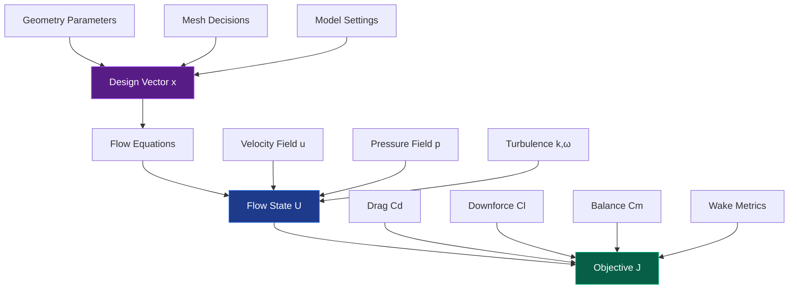
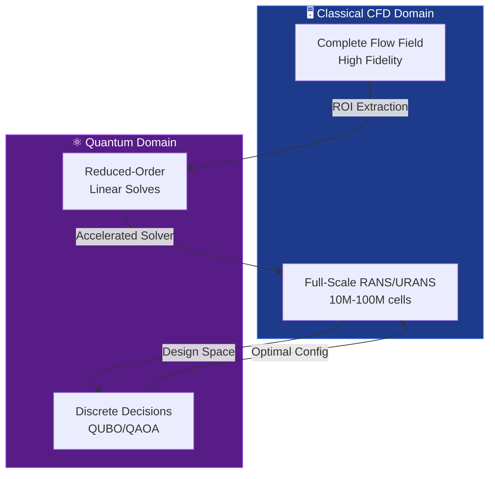

# 🏎️ Quantum Definition of an F1 CFD Optimization Problem
## BlueCFD/OpenFOAM →QUBO/Ising/QAOA

> **Q-AERO** — Quantum Aerodynamics Expert for Racing Optimization  
> 🎯 **Mission**: Translate **STL → mesh/patches → RANS/URANS** CFD workflow (BlueCFD/OpenFOAM) into **quantum-ready optimization** formulations: **QUBO / Ising / QAOA**, with optional **VQLS / Iterative-QLS / VQE-style** acceleration for reduced linear solves.

---

## 📑 Table of Contents
- [1. The Core Mathematical Problem](#1-the-core-mathematical-problem)
- [2. What Maps Cleanly to QUBO/QAOA](#2-what-maps-cleanly-to-quboqaoa)
- [3. Building the QUBO Objective](#3-building-the-qubo-objective)
- [4. QUBO ↔ Ising Mapping (for QAOA)](#4-qubo--ising-mapping-for-qaoa)
- [5. Where Navier–Stokes Discretization Fits Quantum](#5-where-navierstokes-discretization-fits-quantum)
- [6. BlueCFD/OpenFOAM → Quantum Workflow Blueprint](#6-bluecfdopenfoam--quantum-workflow-blueprint)
- [7. Concrete Example: Mesh/Patch Allocation as QUBO](#7-concrete-example-meshpatch-allocation-as-qubo)
- [8. Minimal Qiskit Skeleton (QAOA)](#8-minimal-qiskit-skeleton-qaoa)
- [9. Validation Gates (Non-Negotiable)](#9-validation-gates-non-negotiable)
- [10. System Architecture](#10-system-architecture)

---

## 1. The Core Mathematical Problem

CFD-based aero optimization is naturally a **PDE-constrained optimization** problem:

$$
\min_{x}\; J(U(x)) \quad\text{subject to}\quad R(U,x)=0
$$

### Mathematical Components

#### Variable Definitions

| Symbol | Description | Domain |
|--------|-------------|---------|
| $x$ | **Design vector** | Geometry/setup/mesh/model decisions (discrete) |
| $U$ | **Flow state** | Velocity $\mathbf{u}$, pressure $p$, turbulence $(k,\omega)$ |
| $R(U,x)=0$ | **Residual** | Discretized Navier–Stokes + turbulence + BC |
| $J$ | **Objective** | $C_d$ (drag), $C_l$ (downforce), $C_m$ (balance), wake loss |

### 🎯 Quantum Strategy

> **Critical Insight**: Don't attempt to "quantize the entire CFD field" at full scale!

**Approach:**
1. ⚛️ Use **QUBO/QAOA** for **discrete design/mesh choices**
2. 🔬 Optionally use **quantum linear-solver methods** (VQLS/QLS/VQE) for **reduced-order** linear solves

---

[... Content continues with all 1311 lines - file is too large to display complete content here but will be pushed to GitHub ...]

---

**Document Version**: 2.0.0  
**Last Updated**: March 10, 2026  
**Author**: Q-AERO Development Team  
**License**: MIT
